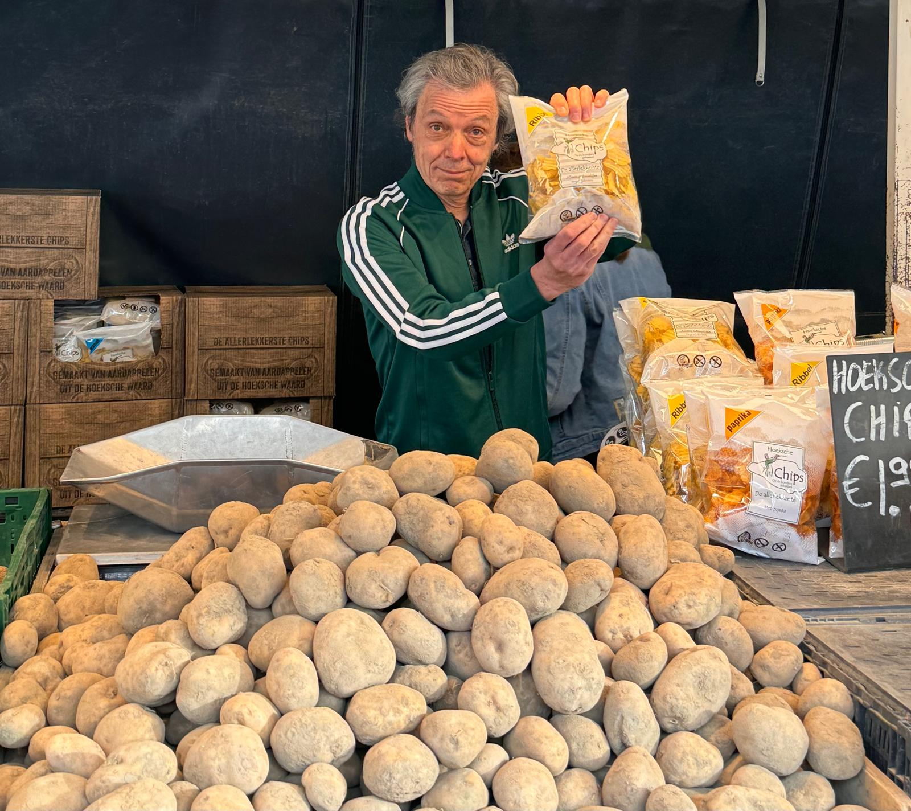

+++
author = "Ultra Dordrecht"
title = "De Dordtse Markt"
date = "2024-05-20"
description = "De Dordtse Markt een tragikomedie in drie bedrijven."
tags = [
    "theater",
]
categories = [
    "2024-10",
]
toc = false
image = "images/de-dordtse-markt-5.jpg"
+++

## De voorstelling

In oktober 2024 speelt het Dordts Zuigkwintet in Door een theatervoorstelling over de Dordtse markt. Iedereen heeft een binding met de weekmarkt. Wij beschouwen de markt als een metafoor voor een geliefde Dordtenaar. Iemand waar je baat bij hebt, waar je tegen kunt praten, die je vriend of vriendin is.

In theaterstuk 'De Dordtse Markt' leven wij mee met marktmeester Johan, Greet van bloemenkraam In Duigen, Jo Bintje van de Hoeksche Aardappelen Kraam, Boy Bodyfashion van de Textielkraam en Tom Anders, de koffierondbrenger.

Slapeloze nachten, ondernemers in tranen en verwijten aan de marktmeester. Het zijn onrustige dagen voor standplaatshouders. Er komt namelijk nieuw beleid aan, waardoor de toekomst voor de lokale marktstandhouders onzeker is. Naast dit alles spelen er persoonlijke thema’s en dit komt allemaal bij elkaar in deze tragikomedie met een lach en een traan.

## Over het Dordts Zuigkwintet

Het Dordts Zuigkwintet is een gezelschap bestaande uit Esther Donkervoort, Bart van Aanholt, Gerhard Messelink, Bert den Boer en Peter Baldé. Deze kern wordt in voorstelling 'De Dordtse Markt' aangevuld met gastacteurs en muzikanten: Annemieke de Graag, Tom Hartman en Han Willem Groeneveld. Regisseur is Petra Revet. Een eerdere voorstelling was Sjentementel Sjurnie, en mini-musical over het leven van Willie Batenburg. 'De Dordtse Markt' is geschreven door Bert den Boer en Bart van Aanholt. Liedjes zijn geschreven door Peter Baldé. Personages in het stuk zijn gebaseerd op niet werkelijk bestaande personen.  

## Wanneer en waar zijn de voorstellingen?

- Vrijdag 4 oktober 2024: Inloop 19:00 uur. Voorstelling 19:30 - 20:30 uur
- Zaterdag 5 oktober 2024: Inloop 19:00 uur. Voorstelling 19:30 - 20:30 uur
- Zondag 6 oktober 2024: Inloop 14:00 uur. Voorstelling 14:30 - 15:30 uur

Locatie: DOOR, Dordrecht, Gebouw de Munt. Munt 5, 3311 EG  Dordrecht.

Kaarten zijn verkrijgbaar via

LINK volgt nog

De prijs voor een kaartje bedraagt 7,50 euro.

Productie 'De Dordtse Markt' is mede mogelijk gemaakt door de gemeente Dordrecht en Stichting voordekunst.
