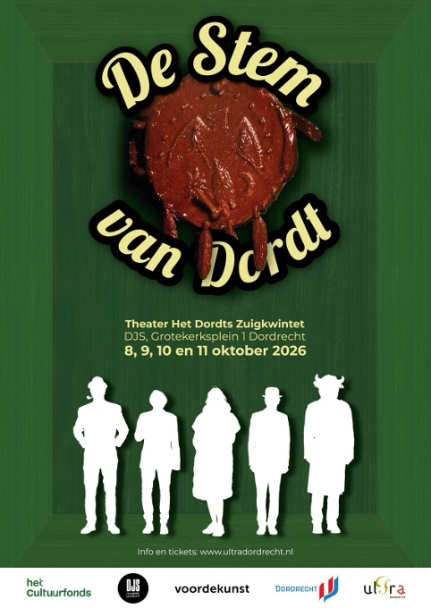

+++
author = "Ultra Dordrecht"
title = "De Stem van Dordt"
date = "2026-08-21"
description = "Is er nog toekomst voor cultuur in Dordrecht? Theaterrecensent Thierry de Bakker is idolaat van de Dordtse dichter en schrijver C. Buddingh’ Hij breekt zich het hoofd over hoe hij in deze tijd zijn werk onder de aandacht kan brengen. Wellicht bieden de financiële problemen van DDO, De Dordtse Omroep, mogelijkheden. Kunnen rouwclown August de Gene en zangeres Bobby Kween hem hierbij helpen? Hoe gaat hij om met de opportunistische politicus Albert-Henk van Schapendrift die zo zijn eigen ideeën heeft over kunst en cultuur? Het komt allemaal voorbij in een nieuw muzikaal theaterspektakel van het Dordts Zuigkwintet waarin de geest van Kees Buddingh’ rondwaart."
tags = [
    "theater",
]
categories = [
    "2026-10",
]
toc = false
image = "images/stem-1.jpg"
+++

## De voorstelling

Na de succesvolle mini-musical over de Dordtse legende Willie Batenburg en een theaterstuk over de 'De Dordtse Markt' is het toneelgezelschap ‘Het Dordts Zuigkwintet’ volop aan het repeteren voor een derde theaterstuk ‘De Stem van Dordt'.

Op 8, 9, 10 en 11 oktober 2026 spelen we in muziekpodium DJS aan de Grotekerksbuurt 1 in Dordrecht.

## Over het Dordts Zuigkwintet

Het Dordts Zuigkwintet is een gezelschap bestaande uit Esther Donkervoort, Bart van Aanholt, Gerhard Messelink, Bert den Boer en Peter Baldé. Deze kern wordt in voorstelling 'De Stem van Dordt' aangevuld met een muzikale invulling door: Annemieke de Graag. Regisseur is Petra Revet.

## Wanneer en waar zijn de voorstellingen?

- Donderdag 8 okt 2026, Deuren open: 20:00, Aanvang: 20:30 [Tickets via stager voor de 8e](https://muziekpodiumdjs.stager.co/shop/default/events/111692927)
- Vrijdag 9 okt 2026, Deuren open: 14:00, Aanvang: 14:30 [Tickets via stager voor de 9e](https://muziekpodiumdjs.stager.co/shop/default/events/111692930)
- Zaterdag 10 okt 2026, Deuren open: 14:00, Aanvang: 14:30 [Tickets via stager voor de 1oe](https://muziekpodiumdjs.stager.co/shop/default/events/111692931)
- Zondag 11 okt 2026, Deuren open: 20:00, Aanvang: 20:30 [Tickets via stager voor de 11e](https://muziekpodiumdjs.stager.co/shop/default/events/111692929)

Locatie: DJS, Dordrecht, Grotekerksplein 1.

De prijs voor een kaartje bedraagt 8,50 euro.

Tickets zijn verkrijgbaar via https://muziekpodiumdjs.nl/

De Stem van Dordt is mede mogelijk gemaakt door het Cultuurfonds Zuid-Holland, de gemeente Dordrecht, DJS, stichting Ultra Dordrecht en donateurs via Stichting voordekunst.
